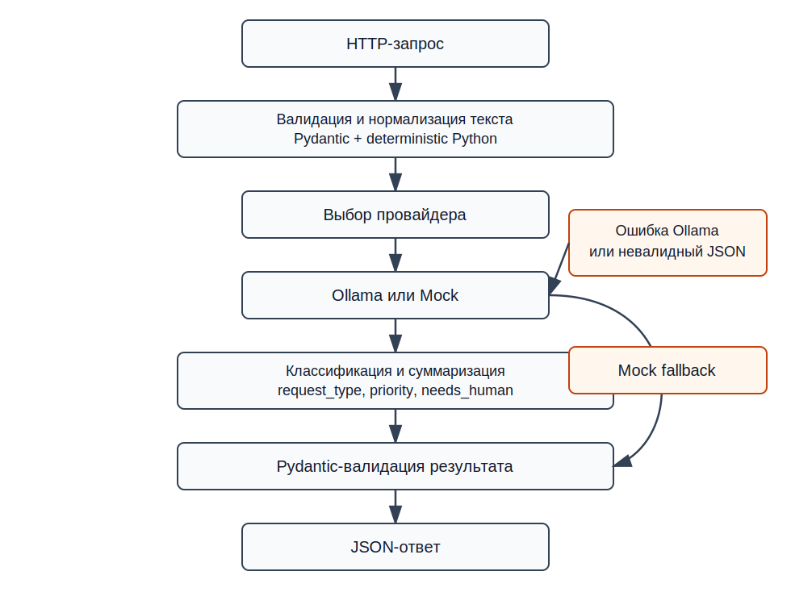

# AI Request Agent

Локальный прототип AI-агента для анализа текстовых обращений пользователей.
## Выбранный кейс

**Кейс 1 — AI-агент для обработки текстовых обращений.**

## Что реализовано

- FastAPI endpoint `POST /api/v1/requests/analyze`.
- Healthcheck `GET /health`.
- CLI-запуск через `python -m request_agent.main`.
- Pydantic v2 схемы и строгие enum для типов обращений и приоритетов.
- Mock-провайдер по умолчанию, работающий без Ollama, интернета и API-ключей.
- Ollama-провайдер через HTTP API `/api/chat`.
- Автоматический `mock_fallback`, если Ollama недоступна, вернула невалидный JSON или результат не прошел валидацию.
- Тесты для API, схем, mock-логики, fallback и общего сервисного слоя.
- Draw.io и SVG flow-схема.

## Что замокано

В режиме `LLM_PROVIDER=mock` NLP-решение имитируется детерминированными правилами и ключевыми словами. Это нужно, чтобы проверяющий мог запустить проект сразу после установки зависимостей. Mock не использует внешние сервисы и не делает случайных выборов.

## Архитектура



Поток обработки:

1. HTTP или CLI получает текст обращения.
2. Pydantic валидирует и нормализует текст.
3. Сервис выбирает провайдера: `mock` или `ollama`.
4. Провайдер возвращает NLP-результат.
5. Python-код валидирует результат через Pydantic.
6. API или CLI возвращает строгий JSON.
7. При ошибке Ollama включается `mock_fallback`.

## Структура проекта

```text
ai-request-agent/
├── README.md
├── pyproject.toml
├── .env.example
├── .gitignore
├── LICENSE
├── src/request_agent/
│   ├── api.py
│   ├── config.py
│   ├── main.py
│   ├── prompts.py
│   ├── schemas.py
│   ├── service.py
│   ├── providers/
│   └── utils/
├── tests/
├── examples/
└── docs/
```

## Требования

- Python 3.11+
- FastAPI
- Uvicorn
- Pydantic v2
- httpx
- pytest
- ruff
- Ollama опционально

## Установка

```bash
git clone https://github.com/bragind/ai-request-agent.git
cd ai-request-agent

python -m venv .venv
```

Windows:

```bash
py -3.12 -m venv .venv
.\.venv\Scripts\Activate.ps1
python -m pip install -e ".[dev]"
```

Linux/macOS:

```bash
source .venv/bin/activate
```

Установка зависимостей:

```bash
pip install -e ".[dev]"
```

## Запуск API

По умолчанию используется mock-режим.

```bash
uvicorn request_agent.api:app --reload
```

Swagger UI:

```text
http://127.0.0.1:8000/docs
```

Healthcheck:

```bash
curl http://127.0.0.1:8000/health
```

Пример запроса:

```bash
curl -X POST "http://127.0.0.1:8000/api/v1/requests/analyze" \
  -H "Content-Type: application/json" \
  -d "{\"text\":\"Не могу войти в личный кабинет, появляется ошибка 403\"}"
```

PowerShell:

```powershell
Invoke-RestMethod `
  -Method Post `
  -Uri "http://127.0.0.1:8000/api/v1/requests/analyze" `
  -ContentType "application/json" `
  -Body '{"text":"Не могу войти в личный кабинет, появляется ошибка 403"}'
```

## Запуск CLI

```bash
python -m request_agent.main
```

После запуска введите текст обращения в терминале. CLI использует тот же `RequestAnalysisService`, что и API.

## Запуск тестов и линтера

```bash
python -m compileall src
ruff check .
pytest
```

Все тесты работают без установленной Ollama и без доступа к интернету.

## Запуск с Ollama

Установите и запустите Ollama локально, затем загрузите модель:

```bash
ollama pull qwen2.5:7b
```

Переменные окружения:

```bash
LLM_PROVIDER=ollama
OLLAMA_BASE_URL=http://localhost:11434
OLLAMA_MODEL=qwen2.5:7b
```

Если Ollama недоступна, произошел таймаут, модель вернула невалидный JSON или неизвестный enum, запрос все равно будет обработан через `mock_fallback`.

## Переменные окружения

| Переменная | Значение по умолчанию | Описание |
| --- | --- | --- |
| `LLM_PROVIDER` | `mock` | `mock` или `ollama` |
| `OLLAMA_BASE_URL` | `http://localhost:11434` | Адрес локальной Ollama |
| `OLLAMA_MODEL` | `qwen2.5:7b` | Имя модели Ollama |
| `OLLAMA_TIMEOUT_SECONDS` | `15` | Таймаут HTTP-запроса |

## Пример входного запроса

```json
{
  "text": "Не могу войти в личный кабинет. После ввода пароля появляется ошибка 403. Прошу помочь как можно скорее."
}
```

## Пример JSON-ответа

```json
{
  "request_type": "account_access",
  "summary": "Не могу войти в личный кабинет.",
  "priority": "high",
  "needs_human": true,
  "confidence": 0.92,
  "provider": "mock"
}
```

Допустимые `request_type`:

```text
technical_issue
billing
account_access
complaint
consultation
feature_request
other
```

Допустимые `priority`:

```text
low
medium
high
critical
```

Фактически использованный провайдер указывается в поле `provider`: `mock`, `ollama` или `mock_fallback`.

## Почему AI используется только для NLP

LLM полезна там, где нужно понять естественный язык: классифицировать обращение, сформулировать короткое summary, оценить приоритет и уверенность. Но валидация входа, проверка enum, обработка ошибок, fallback и формирование финального JSON должны быть детерминированными. Поэтому эти части реализованы обычным Python-кодом и Pydantic-схемами.

## Ограничения прототипа

- Нет базы данных и истории обращений.
- Нет авторизации и rate limiting.
- Нет CRM/helpdesk-интеграции.
- Mock-режим основан на правилах и не заменяет полноценную модель.
- Качество Ollama-режима зависит от локальной модели.
- Prompt injection отдельно не фильтруется, так как прототип не выполняет инструменты и не работает с секретами.


